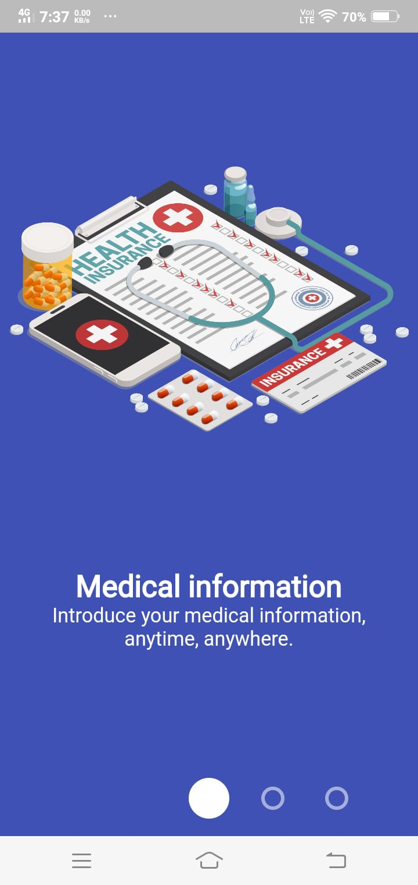
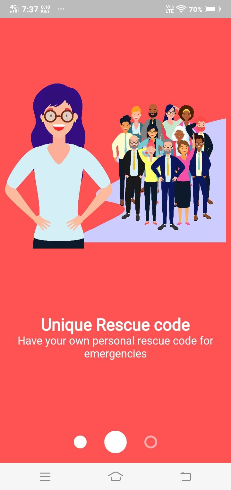
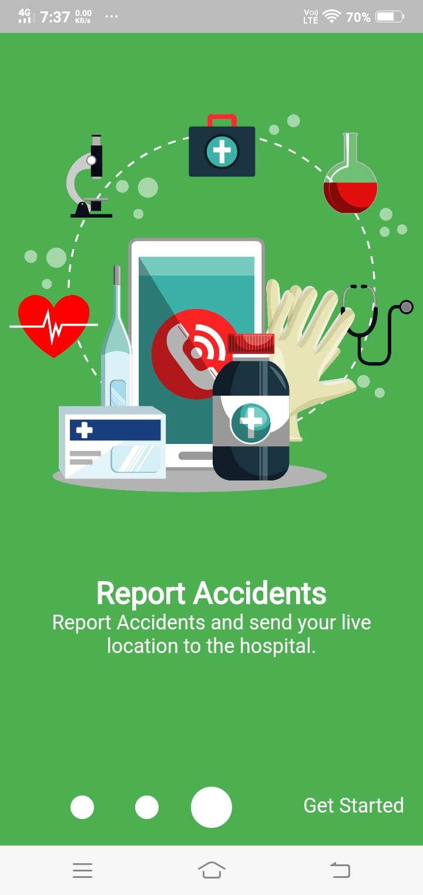
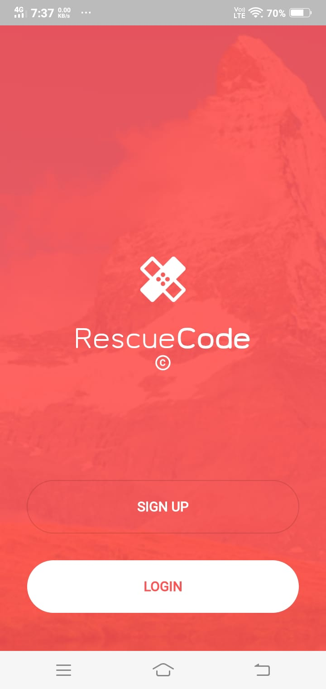
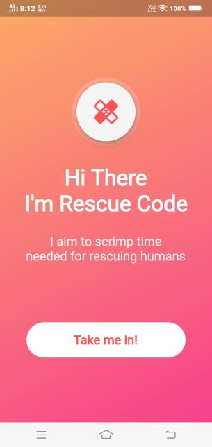
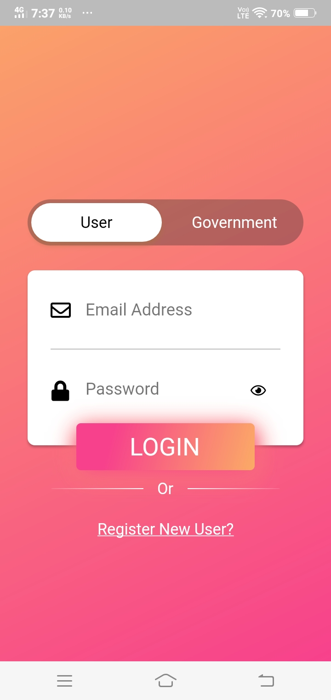

<h3> APK Screenshot </h3>

 
 
 
 
 

<h3> Rescue Application ↯</h3>

 
• Presentation :  

• Rescue code app aims to scrimp time needed for rescuing human's live in emergency time.
 

• We aim to develop an application that consolidates the necessary operations performed during this  pandemic into one common-to-use platform and ease the burden so people can make decisions faster and  complete things smoother. Providing a structured vaccination drive is crucial for penetrating into the larger society and making sure everybody gets their dose. the second wave drastically impacted our healthcare infrastructure and delayed the production of vaccines. 

• Our application gathers the complete data of the supplied vaccines by consolidating them, and breaking down to the lowest possible parameter. So, users can get detailed analysis of the available vaccines in every hospital along with the prediction of when the hospital has to refill based on a threshold value.

• Users can also register in their preferred date and time slot for the vaccination drive, so that waiting times and delays are eradicated and crowds forming can be prevented, thereby enabling us to perform in a structured manner. 

• An Ambulance feature helps you to contact the nearest ambulance and map to your location for faster reach and immediate medical assistance.

 

 
